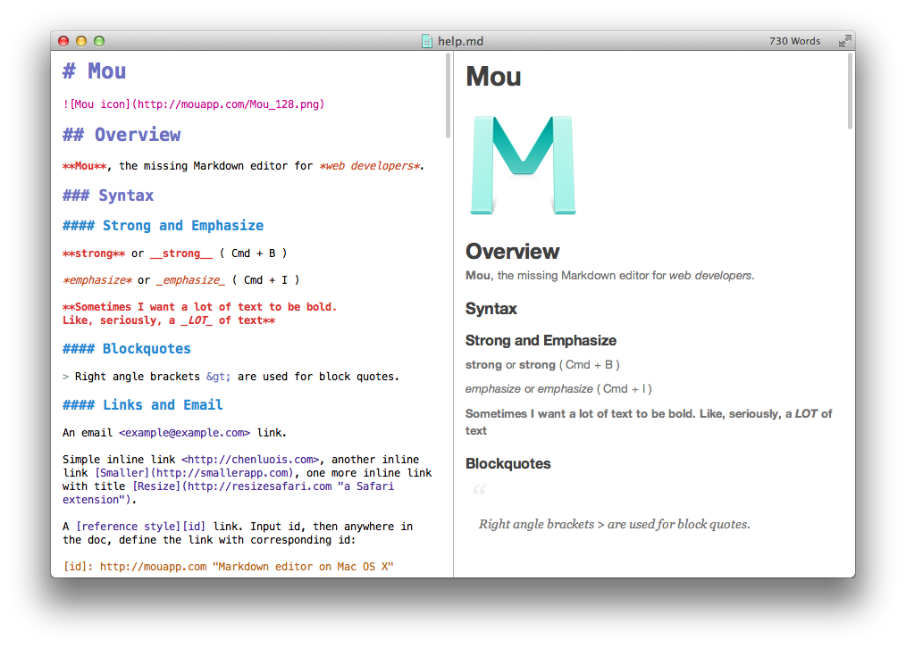
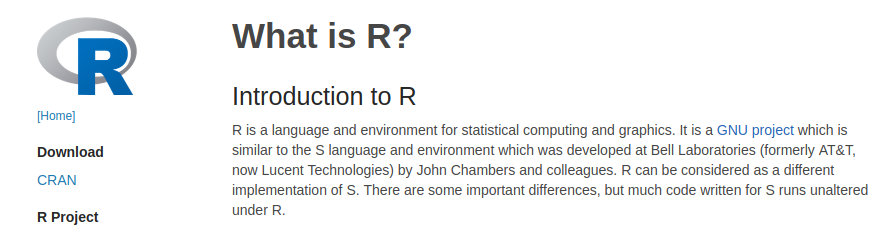
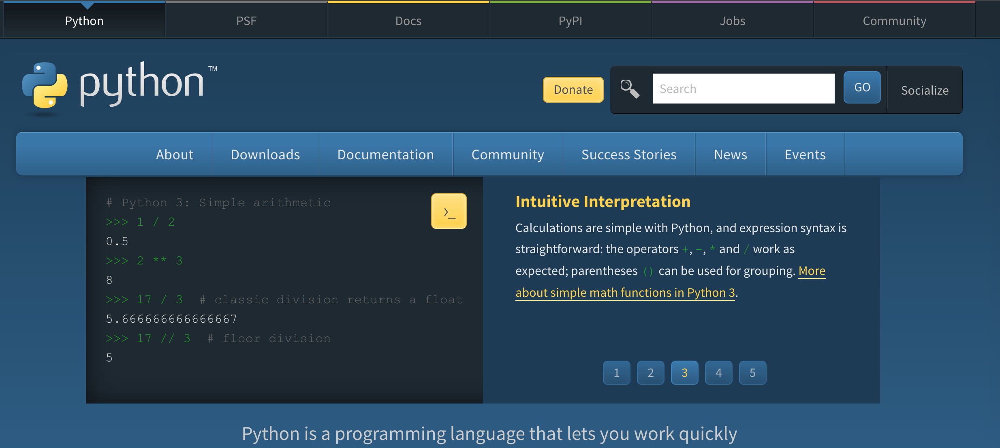
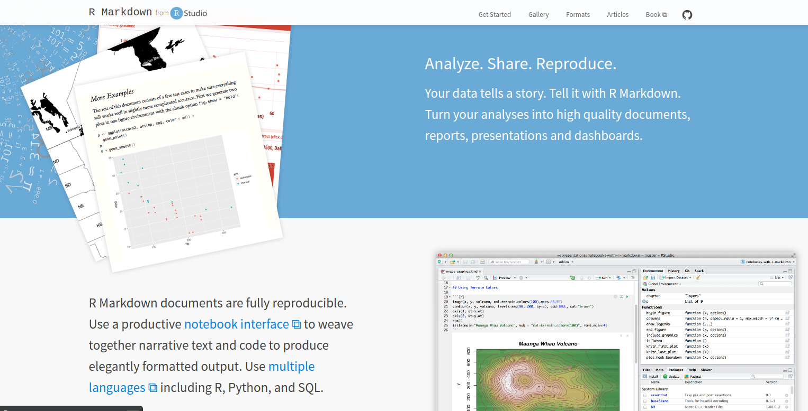
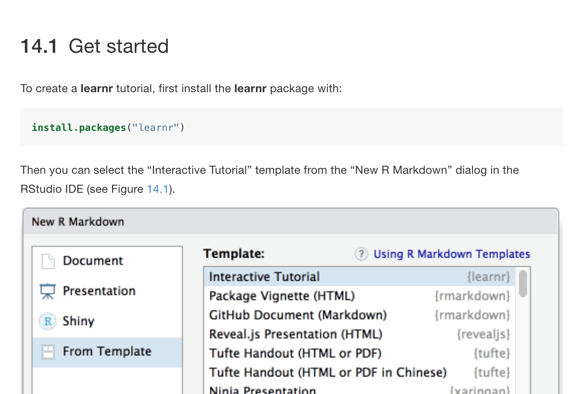

<!-- .slide: data-background="img/Logos_reveal.png" -->

### Managing Documentation in a world overloaded with information

> Jesús López de Leyva - CATEDU (Centro Aragonés de Tecnologías para la Educación - Aragonese Center of Technologies for Education)

[www.catedu.es](http://www.catedu.es)

---
<!-- .slide: data-background="img/Logos_reveal_s.png" -->

## Thanks to [Florian Stampfer](https://www.uibk.ac.at/dingim/team/stampfer/)

---
<!-- .slide: data-background="img/Logos_reveal_s.png" -->


---
<!-- .slide: data-background="img/Logos_reveal_s.png" -->

```markdown
## Tutoriales

### ¿Quieres descargártelos?

Todos se encuentran en éste repositorio de GitBook https://legacy.gitbook.com/@catedu. DESCARGABLES EN FORMATO PDF, ePUB, eMobi.. y CON LICENCIA CC puedes usarlos en tus clases respetando la licencia.


```

---

<!-- .slide: data-background-iframe="https://catedu.gitbooks.io/robotica/content/" data-background-interactive -->

---
<!-- .slide: data-background="img/Logos_reveal_s.png" -->



---
<!-- .slide: data-background="img/Logos_reveal_s.png" -->

## R and Python

[](https://www.r-project.org/about.html) <!-- .element height="50%" width="50%" -->

[](https://www.python.org/) <!-- .element height="50%" width="50%" -->

---
<!-- .slide: data-background="img/Logos_reveal_s.png" -->


---
<!-- .slide: data-background="img/Logos_reveal_s.png" -->

[](https://rmarkdown.rstudio.com/)

---
<!-- .slide: data-background="img/Logos_reveal_s.png" -->

[](https://rmarkdown.rstudio.com/)

---
<!-- .slide: data-background="img/Logos_reveal_s.png" -->

### [Interesting examples](https://gallery.shinyapps.io/cran-gauge/)

---
<!-- .slide: data-background="img/Logos_reveal_s.png" -->

## The good part of doing it with traditional software
* Easy and visual
* You do not need to learn programming.

---
<!-- .slide: data-background="img/Logos_reveal_s.png" -->

## The bad part of doing it with traditional software 
* It is not a reproducible workflow.
* It is much more difficult to have the data updated.
* Bad integration with version control.
* Lack of versatility
* Diversity of software that can lead to incompatibilities.
* You do not learn programming, which would help you to understand the technology as an active citizen, not as a mere consumer.

---
<!-- .slide: data-background="img/Logos_reveal_s.png" -->

## Examples of reproducible workflows

[Here](https://colab.research.google.com/drive/1MucxxfaLjmqnjYg4-qy8C8piVFzw757I) we can see a reimplementation of the famous visualization of the relationship of life expectancy related to the per capita income of each country using the Gapminder DataSet

---
<!-- .slide: data-background="img/Logos_reveal_s.png" -->

## RMarkdown and WikiData

What if we used [wiki-data](https://query.wikidata.org/) to get some interesting data, such as data about More populated cities with a woman as a major.

---
<!-- .slide: data-background="img/Logos_reveal_s.png" -->

## RMarkdown and Music

In [this article](https://pushpullfork.com/exploring-musical-data-with-r/) we have an R script and a dataset that we can download. If we run it, we can see the output of the script. What if we wanted to make it presentable to an audience? Let's start a document in RMarkdown.

---
<!-- .slide: data-background="img/Logos_reveal_s.png" -->

## Writing blogs

```r
install.packages("blogdown")
```

---
<!-- .slide: data-background="img/Logos_reveal.png" -->

# Thank you


